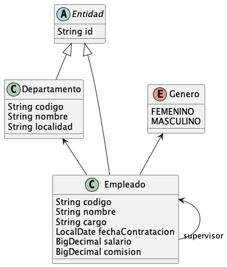

# Scott: Un Ejemplo de DSL Funcional en Java


Este repositorio ilustra el diseño, implementación y uso de un lenguaje de dominio específico (DSL) en Java 17
empleando patrones funcionales.
El argumento de estudio es una aplicación SpringBoot JPA inspirada en el tradicional esquema Oracle _scott/tiger_.
Para comprender las técnicas empleadas para implementar este DSL se requiere familiaridad con las 
[lambdas de Java](https://docs.oracle.com/javase/tutorial/java/javaOO/lambdaexpressions.html) 
así como con 
[Spring Data JPA](https://spring.io/projects/spring-data-jpa).

El DSL implementado en este repositorio captura patrones repetitivos en el uso de repositorios JPA desde componentes 
Spring con estereotipo de servicio (`@Service`).

Un servicio Spring típico implementaría imperativamente la persistencia de una nueva instancia de `Departamento` en 
la base de datos como:

```java
// Retorna el id generado para una nueva instancia de departamento persistida exitosamente
// o causa una excepción en cada posible escenario de falla
public String crearDepartamento(String codigo, String nombre, String localidad) {
    // Construye y valida instancia de departamento
    final Departamento departamento;
    try {
        departamento = Departamento.builder()
                .codigo(codigo)
                .nombre(nombre)
                .localidad(localidad)
                .build();
    } catch (Exception e) {
        throw new RuntimeException("Error de validación creando departamento", e);
    }

    // Persiste nuevo departamento
    final Departamento departamentoGuardado;
    try {
        departamentoGuardado = repositorioDepartamento.save(departamento);
    } catch (Exception e) {
        throw new RuntimeException("Error persistiendo nuevo departamento", e);
    }

    // Retorna id generado para nuevo departamento
    return departamentoGuardado.getId();
}
```

Empleando el DSL implementado en este repositorio, la misma funcionalidad luciría como:

```java
// Retorna id generado para nueva instancia de departamento
public String crearDepartamento(String codigo, 
                                String nombre, 
                                String localidad) {
  return persistirInstancia(
    repositorioDepartamento,
    () -> Departamento.builder()
      .codigo(codigo)
      .nombre(nombre)
      .localidad(localidad)
      .build()
    ));
}
```

## El Modelo de Datos _scott/tiger_

El modelo de datos de ejemplo esta inspirado en el esquema 
[scott/tiger](https://www.orafaq.com/wiki/SCOTT) tradicionalmente empleado por Oracle 
Corporation para enseñar el lenguaje SQL. 

Además de reformularlo en español, en este repositorio se le añade a este modelo algunos pequeños detalles para 
utilizarlo mediante JPA:



La definición de `Departamento` como entidad JPA mostrada a continuación hace uso de 
[Lombok](https://www.javatpoint.com/lombok-java) y de 
[Java EE Validation](https://docs.oracle.com/javaee/7/tutorial/bean-validation.htm)
así como del soporte brindado por la superclase 
[Entidad](src/main/java/scott/infra/jpa/entidad/Entidad.java):

```java
@Entity
@Table(name = "departamento", 
  uniqueConstraints = { @UniqueConstraint(name = "dept_uk_codigo",  
    columnNames = {"codigo"})})
@Getter
@ToString(onlyExplicitlyIncluded = true)
@NoArgsConstructor(access = AccessLevel.PROTECTED)
public class Departamento extends Entidad {
  @ToString.Include
  @NotNull(message = "El código del departamento debe ser especificado")
  @Pattern(regexp = "^[0-9]{2}$", message = "Código de departamento inválido; debe constar de dos dígitos")
  @Basic(optional = false)
  @Column(name = "codigo", nullable = false, length = 2)
  private String codigo;

  @ToString.Include
  @NotNull(message = "El nombre del departamento debe ser especificado")
  @Pattern(regexp = "^\\p{IsLatin}{2,16}$", message = "Nombre de departamento inválido; solo puede contener letras")
  @Basic(optional = false)
  @Column(name = "nombre", nullable = false, length = 16)
  private String nombre;

  @ToString.Include
  @NotNull(message = "La localidad del departamento debe ser especificada")
  @Pattern(regexp = "^\\p{IsLatin}{2,16}$", message = "Localidad de departamento inválida; solo puede contener letras")
  @Basic(optional = false)
  @Column(name = "localidad", nullable = false, length = 16)
  private String localidad;

  @OneToMany(mappedBy = "departamento", cascade = CascadeType.ALL)
  private final Set<Empleado> empleados = new HashSet<>();

  @Builder
  public Departamento(String codigo, 
                      String nombre, 
                      String localidad) {
    this.codigo = codigo;
    this.nombre = nombre;
    this.localidad = localidad;
    validarAtributos();
  }

  public String relocalizar(String nuevaLocalidad) {
    String localidadOriginal = this.localidad;
    this.localidad = nuevaLocalidad;
    validarAtributos();
    return localidadOriginal;
  }
}
```

## Insertando una Nueva Instancia de Entidad (Toma 1)

Para persistir una nueva instancia de `Departamento` se requeriría algo como:

```java
public String crearDepartamento(String codigo, 
                                String nombre,
                                String localidad) {
  // Construye y valida instancia de departamento
  final Departamento departamento;
  try {
    departamento = Departamento.builder()
      .codigo(codigo)
      .nombre(nombre)
      .localidad(localidad)
      .build();
  } catch (Exception e) {
    throw new RuntimeException("Error de validación creando departamento", e);
  }

  // Persiste nuevo departamento
  final Departamento departamentoGuardado;
  try {
    departamentoGuardado = 
        repositorioDepartamento.save(departamento);
  } catch (Exception e) {
    throw new RuntimeException("Error de persistencia creando departamento", e);
  }

  // Retorna id generado para nuevo departamento
  return departamentoGuardado.getId();
}
```

Para persistir una nueva instancia de `Empleado` se requeriría algo _muy semejante_, en el estilo de:

```java
public String crearEmpleado(String codigo, String nombre, Genero genero) {
  // Construye y valida instancia de empleado
  final Empleado empleado;
  try {
    empleado = Empleado.builder()
      .codigo(codigo)
      .nombre(nombre)
      .genero(genero)
      .build();
  } catch (Exception e) {
    throw new RuntimeException("Error de validación creando empleado", e);
  }

  // Persiste nuevo Empleado
  final Empleado empleadoGuardado;
  try {
    empleadoGuardado = 
      repositorioEmpleado.save(empleado);
  } catch (Exception e) {
    throw new RuntimeException("Error de persistencia creando empleado", e);
  }

  // Retorna id generado para nuevo empleado
  return empleadoGuardado.getId();
}
```

En los dos casos se repite el mismo patrón:

- Declarar y poblar una nueva instancia de la entidad, generando una excepción si hay errores de validación
- Guardar la nueva instancia creando así una nueva versión ya almacenada y generando una excepción si hay errores 
  de persistencia
- Retornar la nueva clave primaria generada por el sistema

Varían los detalles, pero el código (repetitivo y tedioso) tiene siempre la misma estructura.

## Claves Naturales y Sintéticas

En el uso de bases de datos relacionales de hoy es frecuente reemplazar las claves primarias "naturales" (tales como 
la _cédula_ de la persona o el _código_ del departamento) por claves primarias "sintéticas" generadas por el sistema.

```sql
CREATE TABLE departamento (
  id   INTEGER   NOT NULL DEFAULT nextval('departamento_seq') PRIMARY KEY,
  codigo VARCHAR(16) NOT NULL UNIQUE,
  nombre VARCHAR(24) NOT NULL
);
CREATE TABLE empleado (
  id        VARCHAR(32) NOT NULL DEFAULT gen_random_uuid() PRIMARY KEY,
  codigo      VARCHAR(16) NOT NULL UNIQUE,
  nombre      VARCHAR(24) NOT NULL,
  id_departamento INTEGER   NOT NULL REFERENCES departamento (id),
  id_supervisor   VARCHAR(32) REFERENCES empleado (id)
);
```

Para impedir que se añadan nuevas instancias con valores duplicados de clave natural es necesario verificar, al 
crear una nueva instancia de la entidad, que no exista ya en su tabla una fila con el mismo valor. Así mismo, se 
requiere añadir a las entidades JPA una anotación `@Table/@UniqueConstraint`

👉 En nuestro repositorio de ejemplo hemos establecido la simplificación de que todas las claves primarias sintéticas
son de tipo `String` y corresponden a un _random `UUID`_ generado desde la aplicación.

## Insertando una Nueva Instancia de Entidad (Toma 2)

Para garantizar que no haya múltiples departamentos con el mismo código, la persistencia de una nueva instancia de 
`Departamento` luciría ahora como:

```java
public String crearDepartamento(String codigo, String nombre, String localidad) {
  // Valida que el código de departamento no sea duplicado
  final Optional<Departamento> optDepartamento;
  try {
    optDepartamento = 
      repositorioDepartamento.findByCodigo(codigo);
  } catch (Exception e) {
    throw new RuntimeException("Error recuperando departamento por código", e);
  }
  optDepartamento.ifPresent(d -> {
    String mensaje = "Ya existe un departamento con codigo %s: %s!".formatted(codigo, d.getNombre());
    throw new IllegalArgumentException(mensaje);
  });
  
  // Construye y valida instancia de departamento
  final Departamento departamento;
  try {
    departamento = Departamento.builder()
      .codigo(codigo)
      .nombre(nombre)
      .localidad(localidad)
      .build();
  } catch (Exception e) {
    throw new RuntimeException("Error de validación creando departamento", e);
  }

  // Persiste nuevo departamento
  final Departamento departamentoGuardado;
  try {
    departamentoGuardado = repositorioDepartamento.save(departamento);
  } catch (Exception e) {
    throw new RuntimeException("Error de persistencia creando departamento", e);
  }

  // Retorna id generado para nuevo departamento
  return departamentoGuardado.getId();
}
```

La creación de una nueva entidad de `Empleado` se verá también aumentada con una verificación adicional equivalente.

Esto es repetitivo, tedioso y _propenso al error_!

👉 **Una de las principales fuentes de _bugs_ en el desarrollo de aplicaciones son los errores en la transcripción de 
recetas repetitivas como esta**.

## Capturando Recetas Repetitivas  (Toma 1)

Qué partes varían de caso en caso en la receta repetitiva que nos ocupa? 

Qué es lo que cambia de entidad en entidad cuando queremos persistir una nueva instancia en la base de datos?

- Cambia el tipo de datos concreto de la entidad (`Departamento`, `Empleado`, ...)
- Cambia la porción de lógica que construye y valida una nueva instancia de la entidad en memoria
- Cambia el método del repositorio que localiza una instancia dado el valor de la clave primaria natural

Todo lo demás tiene _siempre_ la misma lógica!

Para formular las partes móviles de forma reutilizable Java provee dos poderosos aliados: 

- Tipos de datos genéricos y 
- Lambdas

Dado que todas las clases que nos atañen extienden la superclase `Entidad` podemos definir para nuestro método un 
tipo de datos genérico `<E extends Entidad>`. Por extensión, el tipo del repositorio sería 
`<R extends JpaRepository<E, String>>`.

La porción de lógica que construye en memoria una nueva instancia de entidad es una lambda de tipo `Supplier<E>`.

La porción de lógica que retorna una posible instancia de entidad ya existente para el nuevo valor de clave primaria 
natural sería un ``Supplier<Optional<E>>``.

Veamos:

```java
public static<E, I> I persistirInstancia(
  JpaRepository<E, I> repositorio,
  Function<E, I> clavePrimaria,
  Consumer<E> validacion,
  Supplier<E> crearInstancia
) {
  final E entidad;
  try{
    entidad = crearInstancia.get();
  } catch(Exception e){
    throw new ExcepcionServicio("Error creando instancia de entidad en memoria",e);
  }

  if(validacion != null) {
    try{
      validacion.accept(entidad);
    } catch(ExcepcionServicio e){
        throw e;
    } catch(Exception e){
      throw new ExcepcionServicio("Error de validación de entidad",e);
    }
  }

  final E entidadGuardada;
  try {
    entidadGuardada = repositorio.save(entidad);
  } catch(Exception e) {
    throw new ExcepcionServicio("Error persistiendo nueva instancia",e);
  }

  return clavePrimaria.apply(entidadGuardada);
}
```

Armados con este método genérico, la creación de un nuevo departamento luciría como:

```java
public String crearDepartamento(
  String codigo, 
  String nombre, 
  String localidad) 
{
  return persistirInstancia(
    repositorioDepartamento,
    detectarDuplicado(repositorioDepartamento::buscarPorCodigo, codigo),
    () -> Departamento.builder()
      .codigo(codigo)
      .nombre(nombre)
      .localidad(localidad)
      .build()
  ));
}
```

🤩 Aah, _excelente_ simplificación! 

Y es segura en tipos de datos! Si, por error, escribiéramos `repositorioEmpleado` donde debiera decir 
`repositorioDepartamento`, el compilador de Java y/o la IDE nos lo harían saber _de inmediato_.

## Capturando Recetas Repetitivas  (Toma 2)

Nuestro método DSL `persistirInstancia` nos ha traído grandes beneficios ya desde su primera encarnación. 

Pero, como todo en la vida, esta solución es imperfecta:

- No soluciona _todos_ nuestros problemas
- Nos trae _nuevos_ problemas causados por ella misma

Qué problemas nuevos nos trae? 

Uno inmediatamente evidente es que los mensajes de error son demasiado genéricos y no proveen contexto. Donde 
nuestra versión original solía decir `Ya existe un departamento con codigo 30: Ventas!` ahora nuestro método DSL 
reporta un críptico `Ya existe una entidad con la misma clave natural`. Claramente, esto necesita mejorar.

Qué problemas no soluciona?

Un problema con nuestro código original es que hace uso muy liberal de las excepciones.

Algunos programadores Java no verían en esto un problema. Despues de todo, las excepciones son el mecanismo estándar 
del lenguaje para reportar o reaccionar a condiciones de error.

Sin embargo, las excepciones rompen el control de flujo y, tomadas a la ligera, dificultan lidiar con condiciones de 
error. 

👉 En la vida práctica, muchos desarrolladores simplemente ignoran las excepciones y las dejan propagar 
hasta el nivel superior de la aplicación! _Somewhere in the Rytridian Galaxy, Ultra Lord weeps 🥺_


